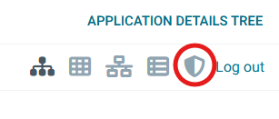
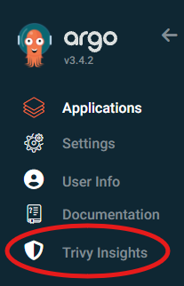

# Argo Trivy Insights

[](https://github.com/DeWildeDaan/argo-trivy-insights/actions)
[](https://github.com/DeWildeDaan/argo-trivy-insights/releases)
[](LICENSE)

Unified security insights for Argo CD applications. View [Trivy Operator](https://aquasecurity.github.io/trivy-operator/) scan results directly in Argo CD—vulnerabilities, exposed secrets, configuration audits, RBAC assessments, and SBOMs—all in one place.

## Features

- **Per-Application View**: "Trivy Insights" tab on Argo CD Application details
- **Cluster-Wide Dashboard**: Aggregate security data across all applications from the sidebar
- **Scan Reports**: Overview, Vulnerabilities, Exposed Secrets, Configuration Audit, RBAC Assessment, SBOM
- **Fast Filtering**: Filter by namespace and resource on the cluster-wide view
- **Zero Bundled Dependencies**: Uses Argo CD's built-in React, keeping the extension lightweight
- **Deeplinks & Exports**: Easely share your findings by exporting them in or sharing a link.SBOM is exported in CycloneDX standard JSON file, all other findings are exported in CSV format.

## Screenshots

### Overview Tab


### Vulnerabilities (Cluster-Wide View)


See the full [screenshot gallery](/docs/GALLERY.MD) for all tabs, themes, and views.

## Installation

Look at the [installation guide](/docs/INSTALL.md) for a more detailed explanation.

### Prerequisites
- Argo CD 2.6+ (for UI extensions support)
- [Trivy Operator](https://aquasecurity.github.io/trivy-operator/) installed and scanning your cluster

### Helm (Production)

Add to your Argo CD Helm values:

```yaml
server:
  extensions:
    enabled: true
    extensionList:
      - name: trivy-insights
        env:
          - name: EXTENSION_URL
            value: https://github.com/DeWildeDaan/argo-trivy-insights/releases/latest/download/extension-trivy-insights.tar.gz
          - name: EXTENSION_CHECKSUM_URL
            value: https://github.com/DeWildeDaan/argo-trivy-insights/releases/latest/download/extension-trivy-insights_checksums.txt
```

### Development (Local Testing)

```bash
npm run install:dev
# Hard-reload Argo CD UI (Ctrl+Shift+R)
```

:warning: Extension is stored in pod `/tmp`, lost on restart. For persistence, use Helm above.

### Compatibility
This extention is currently tested with the following ArgoCD versions:
| ArgoCD Helm chart version | ArgoCD version | Trivy Insights version |
|---|---|---|
| argo-cd-10.3.0 | v3.5.0 | :warning: v1.1.0 |
| argo-cd-10.2.2 | v3.4.6 | v1.0.1 |
| argo-cd-10.1.3 | v3.4.5 | v1.0.1 |
| argo-cd-9.5.22 | v3.4.4 | v1.0.1 |
| argo-cd-9.5.16 | v3.4.3 | v1.0.1 |
| argo-cd-9.5.14 | v3.4.2 | v1.0.1 |

> [!NOTE]  
> :warning: sign indicates breaking change/update needed for the extention to work on that ArgoCD version.

## How It Works

The extension provides two integrated views:

1. **AppView Extension** — "Trivy Insights" tab in Application Details
   - Shows security reports for that application only
   - Reports fetched from the application's namespace

2. **SystemLevel Extension** — "/trivy-insights" sidebar page
   - Aggregates scan results across all applications
   - Includes namespace and application filters
   - Fetches all applications, resolves each one's reports

Both views share report components (Overview, Vulnerabilities, Secrets, Audit, SBOM, RBAC) for a consistent experience.

### How to Access

| View | Where to Find It | Screenshot |
|------|------------------|-----------|
| **Application View** | Navigate to any Application → "Trivy Insights" icon |  |
| **Cluster View** | Sidebar → "Trivy Insights" |  |


---

> 🤖 Built with AI assistance used thoughtfully.
